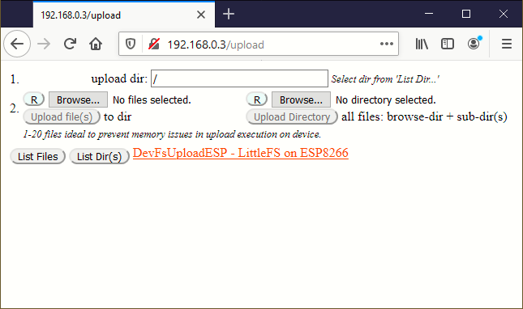
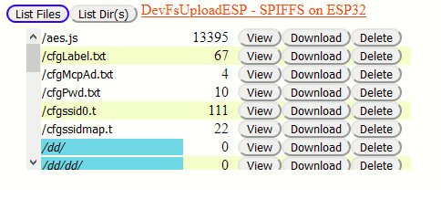
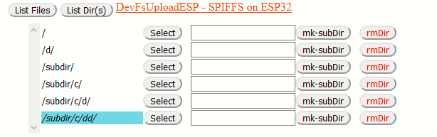

# DevFsUploadESP
 ESP32/8266 file-system upload development tool for SPIFFS or LittleFS
 
 A Arduino set of libraries that provides a browser-UI to manage file-system components on the ESP.
 
 A user needs to install the libraries (found in the libs folder): 
     DevFsUploadCommon, DevFsUploadSPIFFS and DevFsUploadLittleFS.
     
 The capabilities provided are:
 files: list, delete, view
 dirs: list, select (for upload ESP-target-directory) make-sub-directory, remove-directory
 
 upload browse: reset, upload, browse  (all for files ro directory management
 
 ESP-target-directory (for upload location): 'manual' or 'select dir' setting capability
 

NOTE/WARNING: there is no checking for free space on the ESP when uploading files.

Initial page view

List files view

List Dir(s) view 

